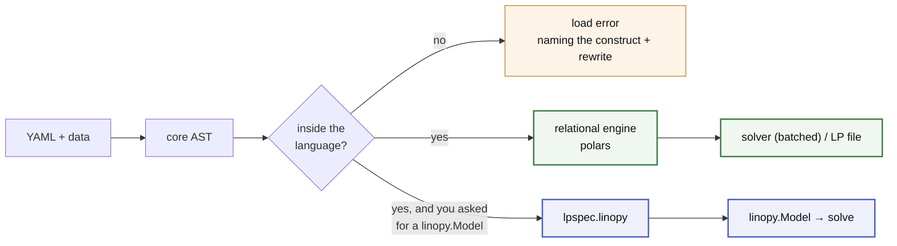

# lpspec

**Self-documenting optimisation models — at any scale.**

Write the math in YAML, attach data at runtime, solve. Today that means linear and
mixed-integer programs. The model is never a dense Python object: it is tidy
tables — masks are absent rows, and a variable's label *is* the solver's own
column index — assembled relationally and handed to the solver in batches.

The consequence worth the headline is **cost to a loaded solver** — YAML and
data in, a populated solver out, no LP file anywhere in between. Measured
against linopy's own best path to the same place, through HiGHS — the solver
`lps.solve` reaches for when you name none
([benchmarks](docs/about/benchmarks.md)):

- **1.01x to 1.29x faster**, on `dispatch` at 10M variables and `fleet` at 12M,
  at 0.83x and 0.84x of linopy's peak memory.
- **Most of what that measures is the solver, not either library.** Of lpspec's
  1.51 s at 10M variables, 0.57 s is the build and 0.94 s is HiGHS taking the
  model.

**Through Gurobi the ranking holds and the margin narrows**, to 1.04x to 1.17x
across four models at 0.73x to 0.98x of the peak. There is less of either
library left in it. The same 10M-variable model costs 9.85 s to a loaded Gurobi
and 1.51 s to a loaded HiGHS. Raw `gurobipy`, with no modelling layer at all,
costs 9.31 s of that 9.85 s: lpspec adds 0.54 s to the floor and linopy adds
1.98 s, so the libraries land 1.15x apart while what each adds is 3.7x apart.
Read the sink you use; the page has a table per sink.

**Every case in that ladder is dense**: no mask in it removes a row, and a dense
coordinate product is the shape an array engine is built for. Sparsity is what
this engine is designed around, and nothing published measures it yet. The
sparse cases are [on the list](docs/about/benchmarks.md#not-measured-yet).

A third property is architectural rather than measured, and named here as such:
**nothing accumulates between builds** — no process-wide state, no lifetime to
leak — so the hundredth rolling-horizon window should cost what the first did.
No benchmark pins that yet; it is [on the
list](docs/about/benchmarks.md#not-measured-yet).

And because the math is a closed spec known before any data is touched, every
name, dimension and expression is checked at load time — `check()` compiles a
whole model repository in CI with nothing attached to it at all.

<!--flow-start-->

<!--flow-end-->

## Example

<!--quickstart-start-->
<!--model-start-->
```yaml
# dispatch.yaml
dimensions:
  snapshot: {dtype: int}
  generator: {dtype: str}
parameters:
  p_max: {dims: [generator]}
  load:  {dims: [snapshot]}
  cost:  {dims: [generator]}
variables:
  p:
    foreach: [snapshot, generator]
    where: "p_max > 0"
    bounds: {lower: 0, upper: p_max}
constraints:
  power_balance:
    foreach: [snapshot]
    expression: sum(p, over=generator) == load
objective:
  sense: minimize
  expression: sum(p * cost)
```
<!--model-end-->

<!--solve-start-->
```python
import lpspec as lps, polars as pl

generators = ['wind', 'solar', 'gas']
sources = {
    'p_max': pl.DataFrame({'generator': generators, 'value': [100.0, 60.0, 200.0]}),
    'cost': pl.DataFrame({'generator': generators, 'value': [1.0, 2.0, 50.0]}),
    'load': pl.DataFrame({'snapshot': range(6), 'value': [80.0, 120.0, 150.0, 180.0, 140.0, 100.0]}),
    'snapshot': range(6),
    'generator': generators,
}

result = lps.solve('dispatch.yaml', sources)
print(result.objective)  # 1920.0
print(result.primal('p'))  # a tidy table: (snapshot, generator, value)
print(result.dual('power_balance'))  # the price at each snapshot
```

Sources can also be pandas or pyarrow objects, or parquet paths — anything
exposing the Arrow PyCapsule protocol is accepted, and the recogniser imports
none of them. Results come back as tables, so nothing has to be released and
no dataframe library is a dependency: `result.to_pandas('p')`,
`.to_dataarray('p')` and `.to_parquet(dir)` are the bridges out, each named for
what it costs.
<!--quickstart-end-->

## Why

- **Declarative math** — readable without knowing the implementation, and
  self-contained: no Python state changes what a file means. It diffs cleanly in
  review and travels as a research artefact.
- **Sparse by construction** — a mask is an absent row, never a NaN in a dense
  array, so a model pays for the variables it has rather than for its coordinate
  product. Labels *are* the solver's own row and column indices, with no mapping
  in between, which is also what makes reading results a join.
- **Fail early, fail loud** — every expression, `where` string and even *uncalled*
  macro template is parsed and name-checked before a single source is attached.
  Errors name the problem and its rewrite; nothing falls back silently.
- **A finite language with a priced way out** — the ceiling is a closure
  (relational ∩ local), not a feature race; genuinely unsayable math
  goes in an `escape:` island, visible in the file and billed before it runs.

The second use case is taking the same file to [linopy](https://github.com/PyPSA/linopy)
instead of solving it here. One import decides which lane builds it; the
language, the data and the refusals are the same either way:

```python
from lpspec import linopy as lpspec_linopy

m = lpspec_linopy.build('spec.yaml', sources={...})  # a linopy.Model you own
m.solve()
```

linopy is **not a runtime dependency**. The lane above ships under the
`[linopy]` extra, and the same install doubles as the **oracle** every language
feature is differentially tested against — all three relationships are
[one page](docs/about/linopy.md). There is no routing and no fallback: a
construct outside the language is a load error naming its rewrite.

## Docs

Start with [**running a model**](docs/guide.md) — a file and your tables to an
answer, with the language in five links. Then
[preparing the data](docs/howto/data.md) and
[what attaching refuses](docs/reference/data.md), the
[Python API](docs/reference/api.md) for the verbs, and
[the examples](docs/examples/index.md) to browse. What a file may contain is
the [language reference](https://math-spec.readthedocs.io/en/latest/reference/language/),
which lives with the language. Why it is shaped this
way, what it costs and what is refused are together under
[about](docs/about/index.md). All of it is indexed in [docs/](docs/README.md);
to work on it,
[CONTRIBUTING.md](CONTRIBUTING.md).

To see it rather than read it, `python examples/walkthrough.py` runs one small
model through every stage — YAML → schema → core AST → logical plan → model
tables → LP text → solution — printing the artifact each stage produces. It
also runs two models the language refuses, and says why. Its output is
committed as [examples/walkthrough.out](examples/walkthrough.out), if you would
rather read it than run it.

```bash
pip install lpspec  # the relational engine (polars, highspy)
pip install "lpspec[linopy]"  # adds linopy + xarray + pandas: the lane, the
                              # oracle, and to_pandas / to_dataarray
pip install "lpspec[gurobi]"  # adds the gurobi sink: solver_name='gurobi'
pip install "lpspec[xpress]"  # adds the xpress sink: solver_name='xpress'
```

Not a solver wrapper, not a domain package, not a data-loading layer — bring
polars, pandas or xarray objects, Arrow tables, or parquet paths. MIT licensed.

## Prior art

The surface — YAML math, a block per component, `foreach:`, a `where:` string —
comes from [Calliope](https://github.com/calliope-project/calliope);
[linopy](https://github.com/PyPSA/linopy) supplies the shared vocabulary, the
oracle and every benchmark denominator. What was taken from each, and how to
cite them: [prior art and credit](docs/about/prior-art.md).

## Status

Alpha, pre-1.0.

<!--status-start-->
**Breaking changes land without a deprecation cycle.** When a construct is
named wrong, a default is wrong, or a permissive input turns out to hide a
silent wrong answer, it gets fixed rather than aliased — carrying a
compatibility shim for every earlier spelling would defeat the point of a small
language.

In practice: pin an exact version if you depend on this, and read the
[changelog](https://github.com/fluxopt/lpspec/blob/main/CHANGELOG.md) before upgrading — every entry links the PR that
describes the break, and a retired spelling fails at load naming its rewrite
rather than drifting on silently. What exists is tested: real models round-trip
through solve, differentially verified against linopy. It is the
*surface* that is not yet frozen, not the behaviour.
<!--status-end-->
