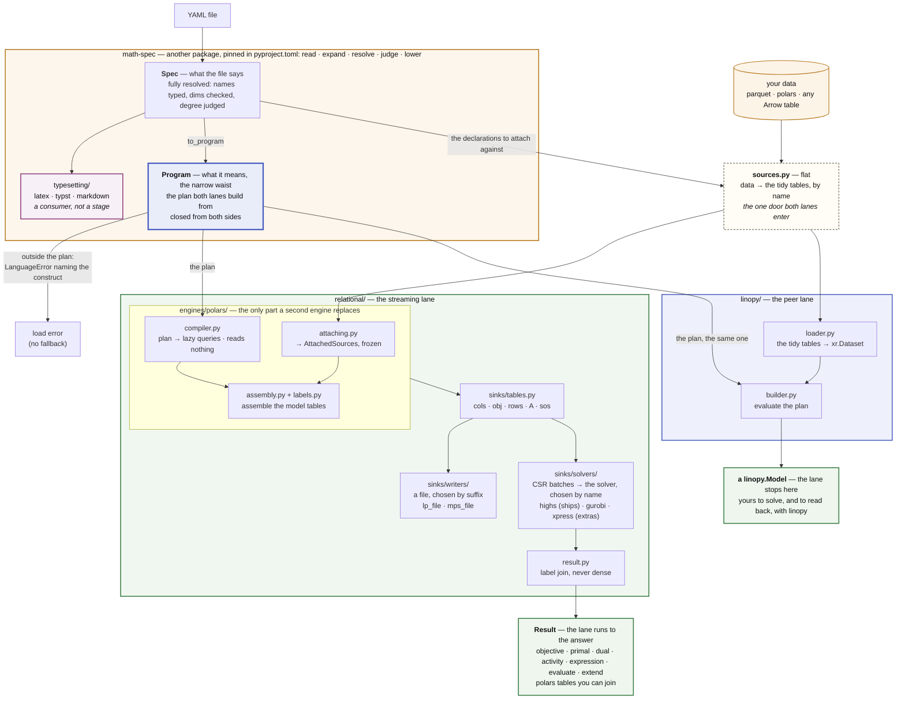
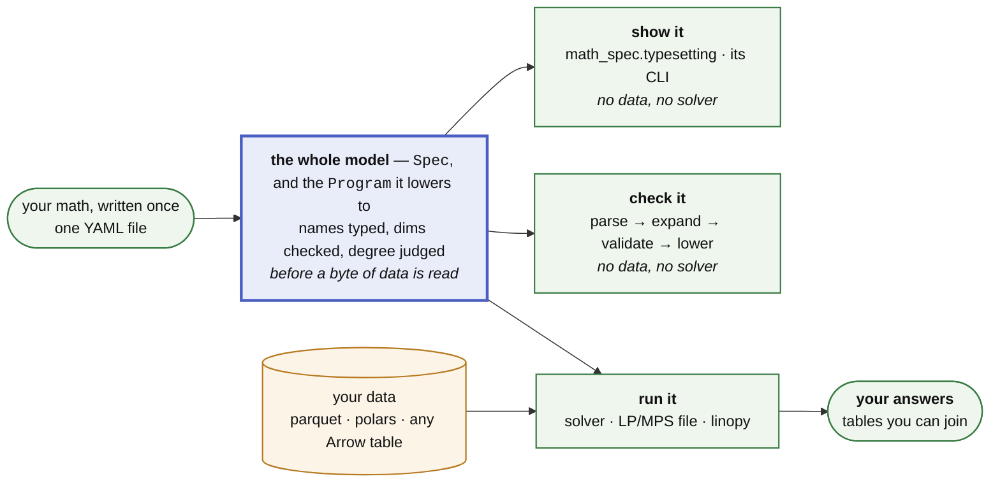

# Architecture

This page explains how the package is put together and why, for anyone who
changes its structure, adds a lane, sink or operator, or decides what may enter
the language.

A PR that changes the structure described here updates this file. The language
is
[the language reference](https://math-spec.readthedocs.io/en/latest/reference/language/).
What may enter it is
[the limits of the language](https://math-spec.readthedocs.io/en/latest/about/limits/). Plans
and refusals are [the roadmap](roadmap.md). Measured results are
[the benchmarks](benchmarks.md), produced by the harness in
[bench/](https://github.com/fluxopt/lpspec/blob/main/bench/README.md), which is
also how a claim on this page gets falsified.

`python examples/walkthrough.py` runs the pipeline below stage by stage,
through the same public calls `lps.solve` makes. Its output is committed as
[examples/walkthrough.out](https://github.com/fluxopt/lpspec/blob/main/examples/walkthrough.out)
and asserted line for line by `tests/test_walkthrough.py`.

[The glossary](../reference/glossary.md) defines the nouns this page uses. The
package builds a program along one of two *lanes*: the relational lane
(`relational/`) streams a plan to a sink, and the linopy lane (`linopy/`)
builds a `linopy.Model` eagerly.

## Thesis

A YAML math spec is a **closed AST known before any data is touched**. So the
whole model can be compiled two ways, to eager xarray/linopy calls or to a
logical plan streamed to a sink, and both paths provably mean the same thing.
A *declared* memory ceiling is not
something the package has; see [the memory axis](roadmap.md#where-it-is-going).

**The producer of the AST is a different package.** `math_spec` parses,
expands, resolves and judges a file, and this repository consumes what comes
out. The widest fence in the drawing is therefore `pyproject.toml`, the amber
box labelled math-spec. Everything in it, the typesetter included, is that one
package, and it cannot import anything here. **Its passes are named in the box
and not drawn**; they are math-spec's architecture, documented and tested
there. The rest is two directories, one per lane.

**Data enters below the seam through one door, and both lanes enter by it.**
The dashed box, `sources.py`, is outside every fence. It reads the schema,
while the engine imports nothing from the package. `sources.tidy_sources`
reads every shape [the data contract](../reference/data.md) accepts into tidy
polars tables. The relational engine executes its plan against those tables
directly. `linopy/loader.py`
converts them to pandas and xarray at its own boundary, and that conversion is
all the linopy lane is. So polars is the one representation, and pandas is
declared with `[linopy]` rather than as a runtime dependency. One reader for
both lanes costs the linopy lane a copy of what a pandas caller passed
(#1076).

The `method: convex` curvature guard sits below the seam because it needs
values rather than a schema. It lives in `curves.py`, which the door calls, so
neither lane can enter without it. Data goes no further **up** than here, so
nothing above the seam has ever seen a value.

The diagram shows the whole pipeline: math-spec reads a file into a `Spec` and
lowers it to the `Program`, `sources.py` turns your data into tidy tables, and
each lane takes both.

**The lanes are peers in what they take, not in what they hand back.** Both
accept the same file, attach the same tables and refuse the same constructs.
`relational/` drains the model through a sink and reads back a `Result`.
`linopy/` stops at the `linopy.Model`: its whole surface is `build` and
`evaluate`, and linopy solves and reads back. A second `Result` there would
be a wrapper around linopy's own API.

**Nine modules sit outside a fence, and each is legitimately both halves**:
`sources.py`, `curves.py`, `api.py`, `strategy.py`, `lanes.py`, `frames.py`,
`parquet.py`, `expressions.py` and `errors.py`. Size does not buy a place among them. A module
only one lane reaches is that lane's, down to a 24-line contextmanager
(`linopy/_notes.py`). See
[What counts as language](#what-counts-as-language).

**Eligibility is decided by attempting the lowering.** `to_program` returns a
`Program` or raises `lps.LanguageError`. Both lanes call it, so "neither lane
accepts a file the other refuses" is mechanical rather than maintained.
`linopy/` discards the plan, having asked only for the verdict. Errors split
model from run. Everything under `LanguageError` is decidable without data,
`DataError` is what a source failed to supply, and both are `LpspecError`
(`errors.py`). `LaneError` is the third thing that can be wrong: a lane may
accept what it cannot build, and says so in its own words
([hard rule 3](#hard-rules)). Expansion precedes validation in **both** lanes,
because a formulation emits declarations and those are language too.

## One contract, many consumers

The AST is a **narrow waist**. Everything upstream emits it, everything
downstream reads it, and nothing else has to agree on anything. So the model
you write once is the same model that gets checked, solved, typeset and read
back.

The diagram shows one YAML file becoming the whole model, and three consumers
reading it: show it, check it and run it.

**Only the run arrow carries data, and it arrives after the model is already
judged.** A `Spec` is complete before a source is attached: names typed, dims
checked, degree decided. `check` is the build's own front half, stopped before
attaching. That is why it is a CI verb, costs seconds, and needs nothing but
the file.

**Each box is a family, and [the table below](#the-python-surface) lists the
members this package answers.** Each reads the same AST the engine reads, so a
renderer is a tree walk, a check is a pass with no data attached, and a new
output format is one module in `relational/sinks/writers/`.

**The renderer is that claim cashed, and it is not here.**
`math_spec.typesetting` typesets any model the lanes can build, in one walk of
the resolved AST: a `piecewise:` block prints as the λ-formulation it expands
to. It lives in the package that owns the language, and this package does not
depend on it. A consumer that reads the AST and nothing else needs no part of
this repository to run. The waist is **closed**, which is what
[the limits of the language](https://math-spec.readthedocs.io/en/latest/about/limits/)
protects: a new consumer is free, a new primitive is taxed.

### The Python surface

**Twenty-five names, and the count is the feature.** The model is the YAML
file, and Python is how you *run* it, so nothing on the surface constructs
math or reaches the plan. The names, by role: the four verbs `check`, `build`,
`solve`, `write`; the fold `solve_over` with its two axes; the two artifacts
that carry a model, its data and its answer, `SolveArchive` and
`SweepArchive`, with `load_archive`, `load_result` and `load_runs` to read
one back; the three types a verb hands back, `Model`, `Result`, `Runs`; the
error tree under `LpspecError`, `NoSolutionError` and `LpspecWarning`. What
each one takes and returns is [the Python API](../reference/api.md). A verb
that answers with no data (`check`) needs nothing but the file.

**Loading a file and rendering one are not on this list.** `to_spec`,
`SymbolTable`, the three `to_…` renderers and the shell front that runs them
are `math_spec.`'s, counted in its own `__all__`: one name, one home. `check`
hands back a `Program` and every verb accepts a `Spec`, but obtaining either
means calling `math_spec`, so a caller annotating one is already in the
package that owns it. **The errors are the only exception**, because a caller
meets them *without choosing to*: a `LanguageError` arrives unbidden out of
`lps.solve`.

**Nothing here reads a `Spec`.** Binding, the guards and both lanes take the
`Program`. A `Spec` reaching a verb is passed straight to
`math_spec.to_program`. The model *as written*, editing, dumping and
typesetting it, is `math_spec`'s side of the line.

**What a verb hands back is part of its signature.** A caller that *wraps*
this package writes the type down, and a type it cannot import is a type it
cannot write. So `Model`, `Result` and `Runs` are named here, as are
`NoSolutionError`, what every reader on a `Result` raises, and
`LpspecWarning`, what `check` emits. A sweep that records an infeasible
scenario rather than dying on it needs both by name. None of the five
constructs math or reaches the plan.

**The namespace is flat, and a namespace marks a lane rather than a topic.**
`lpspec.linopy` is the only one: its own dependencies, its own oracle, its own
surface with its own test. `strategy.py` is not a lane, so `solve_over` and
its axes sit at the top level beside `solve`. The surface test exempts
submodules (`not inspect.ismodule`), so moving names under `lpspec.something`
moves them out from under the list a reviewer reads.

**A return type is not a name.** `build` returns a `Model`, `solve` a `Result`
and `solve_over` a `Runs`, and none is exported. You reach them by calling,
and import them from their module only to annotate. What the objects carry
(`Result` alone has fourteen readers) is [the Python API](../reference/api.md)'s
to list. **A handle's methods answer "what do I do with this", never "what is
this"**: `solve`, `write`, `close` and `update` pass. Anything that changed a
declaration would be a language feature wearing a method, which hard rule 5
refuses wherever it is spelled. The handles are named for what they *are*
rather than for what built them, because a second engine must not change a
top-level verb's return type.

**What the data arrow carries** is [the data contract](../reference/data.md).
The one structural fact: **attaching is by name at both levels**, the mapping
keyed by declared parameter and the columns by that parameter's declared dims.
The single positional fallback (an *unnamed* pandas index) is narrow on
purpose. Renaming a named level would transpose the data silently whenever two
dims share a label space.

`tests/test_architecture.py` pins all of it: `__all__` must match its own
list by role, **and** no public non-module attribute may exist outside it. The first
direction catches a name documented and never exported, the second a helper
that leaked into the namespace from the top of `__init__.py`.

## Hard rules

*Enforced, not aspirational: `tests/test_architecture.py` encodes these as
static checks, and CI's bare-install job proves the dependency claims.*

**These rules constrain the language**: what a construct may say, which layer
may know what, and what a file means on its own. How much a build *costs* is a property of the engine, measured in
[the benchmarks](benchmarks.md), and deliberately not a rule: a cost phrased
as a rule makes one implementation's choice load-bearing in the language's
rulebook.

0. **The layers are ordered, and imports prove it.** Every module imports only
   downward, at module level, with **no exception at all**.
   `DELIBERATE_LAZY_IMPORTS` in `tests/test_architecture.py` is empty, and an
   undeclared in-function import fails the build. A lazy import here is a
   cycle to remove, not to defer.
1. **Core AST is the whole language, and the language is upstream.** Both lanes
   consume only core AST. Macros and `piecewise:` are expanded away before
   dispatch, and so is a named expression unless it states `cases:`. That one
   arrives as a node of its own, because a mask in a value position is not
   something a substitution can carry. The plan, the query and the xarray are
   private to their lane. The AST crossing that seam is **fully resolved**,
   with names typed `Variable`/`Parameter`/`Dimension`, so a lane cannot hold
   its own opinion about what a name refers to. What a model *means* cannot
   depend on what is done with it, because the package that decides the
   meaning cannot import this one ([above](#thesis)). **Our half of it is
   checked**: every `math_spec` import under `src/lpspec` names the package
   and never a module inside it
   (`test_the_language_is_imported_as_one_package`). So what this repository
   depends on is the one `__all__` math-spec pins, never a private name a
   submodule path could carry.
2. **The engine knows nothing about linopy, xarray or YAML.** `relational/`
   goes plan → engine → a solver sink → solver, with linopy's semantics as a
   spec to match rather than code to share. It never sees the schema, the AST,
   or the linopy builder. **The engine is a directory, not a convention.**
   `engines/polars/` is one implementation. Everything above it is what any
   implementation answers to: `sinks/`, `status.py`, and the plan vocabulary,
   which is `math_spec.program`'s. An engine package is named for its engine;
   nothing *inside* one is. The engine imports nothing from the package bar
   one declared leaf (`errors.py`, in `ENGINE_MAY_IMPORT`), which keeps the
   subpackage extractable. **`errors.py` is a leaf by name and not by cost**:
   it re-exports the language's half of the hierarchy, so importing it loads
   the language. What the engine raises through it is `DataError` and
   `LaneError`, a verdict about the *data* or about this lane's reach.
3. **One language, two lanes, and they are not fast and slow versions of each
   other.** Both run the same `to_program` gate ([above](#thesis)), and no
   operator registry exists that could create a divergence. A construct
   outside the language is a load error naming the construct and its rewrite,
   never a redirection to the other lane. What that equality buys is
   [the oracle](linopy.md#2-it-is-the-oracle).

   **Accepting is not building, and one construct now separates them.**
   `linopy.Model.add_constraints` refuses a `QuadraticExpression`, so a
   quadratic *constraint* has no linopy lane. That is declared
   (`capabilities.LINOPY_LANE`), answerable before any build
   (`check(spec, sink='linopy')`) and refused in the language's own words. It
   is the axis
   [the ceiling](https://math-spec.readthedocs.io/en/latest/about/limits/#solver-capability)
   draws for sinks, one level up. **What it costs is the oracle.** A construct
   one lane builds is checked by one lane, through two independent encodings
   reaching one optimum and a residual at the returned primal.
4. **Backend-visible YAML files are self-contained.** No Python-side state
   (registries, session objects) may change what a file means.
5. **The public interface is a declared model, not a Python API.** YAML is what
   we ship and document, and a `.yaml` file is the thing you review, diff and
   cite. There is no API for *constructing* a model, no way to hand in a plan,
   and no registry to populate. The contract underneath is the language's two
   states, a `Spec` and the `Program` it lowers to, and whether that seam is
   ever blessed is open
   ([#381](https://github.com/fluxopt/lpspec/issues/381)). The Python surface
   is the runner (`api.py`) and the driver over it (`strategy.py`); the plan
   is internal. The whole of it is [twenty-one names](#the-python-surface),
   pinned by a test.

## The plan, node for node

**The plan is the vocabulary both lanes speak.** Each node has exactly one
meaning per lane. This table is what the file writes and what the relational
lane's query does with it; the linopy call for each row is
[what a construct becomes](linopy.md#what-a-construct-becomes).
`tests/test_docs_site.py` holds it to `math_spec.program.Expression`'s own
subclasses, so no node lacks a row.

**The plan decides what is sayable; the engine only builds.** Every refusal
about the shape of a file is the language's, made upstream when the spec is
validated and never re-decided on this side of the pin. That covers a
reduction over a dimension its operand does not span, a mask wider than what
it masks, a bound reaching past its variable, and a degree no position takes.
The engine asserts those; reaching one is a program that was never a valid
spec. The two verdicts
it still *raises* are its own: `DataError` about the data, and the `LaneError`
for the one construct the language accepts and this lane cannot build (#1137).

**Fan-in** is the column the lanes *act* on. It says how an output row's slots
relate to the input's, and `math_spec.program.fan_in` answers it for every
node, so a lane asks rather than keeping its own list of which kinds reshape
anything. Anything but one-to-one mixes several input slots into one output
row, so absence has to be pushed into the operand before the rewrite consumes
it ([#1142](https://github.com/fluxopt/lpspec/issues/1142)).

| plan node | the file writes | fan-in | the relational query |
| --- | --- | --- | --- |
| `Constant` | a number | one-to-one | a one-row const fragment |
| `Parameter` | a declared name | one-to-one | its table as `(dims…, cval)` |
| `Variable` | a declared name | one-to-one | `(dims…, var_label, coeff=1)`, plus where it exists; at a read, its primal as a const fragment with the same presence, a zero at every absent slot under `absence: zero` |
| `Dual` | `dual(c)` | one-to-one | at a read only: the constraint's rows beside its share of the dual vector, a const fragment present exactly where a row stands |
| `Negate` | `-x` | one-to-one | the value column negated |
| `Add` | `x + y`, `x - y` | one-to-one | the two fragment lists concatenated |
| `Multiply` | `x * y` | one-to-one | a join on the shared dims; two variable factors pair into a quadratic fragment |
| `Divide` | `x / p` | one-to-one | a **left** join, so a divisor with no value leaves a null to report |
| `Power` | `p ** q` | one-to-one | an inner join and `pow` |
| `Sum` | `sum(x)`, `sum(x, over=d)` | many-to-one | the summed dims projected away — no aggregate |
| `GroupSum` | `sum(x, by=lk)` | many-to-one | one inner join with the lookup's table, the grouped dim traded for its targets |
| `At` | `at(x, by=lk)` | one-to-one | the same table joined the other way, fanning out |
| `Translate` | `shift(x, over=d, offset=n)` | one-to-one | a remap through the dimension's `ord`, modulo its size under `wrap` |
| `Window` | `sum_back(x, over=d, within=w)` | one-to-many | a row lands at every position whose window reaches it — no aggregate |
| `Cases` | a named expression's `cases:` block | one-to-one | each region's value cut to its own mask and the fragment lists concatenated |

A `Cases` is the one node carrying a **mask in a value position**, and the one
whose several values are alternatives rather than slots summed together. The
language proves the regions disjoint and total before any data attaches, so an
output row reads exactly one of them and neither lane ranks them. A region
empty at a coordinate it does not claim must leave the row that the other
regions cover.

**A read is the one walk where every leaf is a number.** A named expression is
evaluated after the solve, never built. The relational lane compiles a variable
to its primal and `dual(c)` to the constraint's row duals, as const fragments;
the linopy lane reads `.solution` and `.dual` and does xarray arithmetic. So
the language holds an entry the math never reads to no degree: a product of
two variables, a variable under a power and a division by one are arithmetic
over values. `Dual` is the one node a build refuses on sight. A solve that left
no duals refuses the read with the sentence `result.dual` gives, and every
other entry still reads.

**Neither reduction aggregates.** A `Sum` drops columns, a `GroupSum` swaps
them and a `Window` replicates rows. Every duplicate collapses once, in the
terminal `SUM(coeff) GROUP BY row, col` at assembly. The polars column
conventions are in `compiler.py` and `fragments.py`.

## The relational lane

**The spine is one module per box above**: `attaching.py`, `compiler.py`,
`assembly.py`, `sinks/`, and `engine.py`, which runs that lifecycle and holds
the solver between solves. `labels.py`, `readback.py` and `result.py` sit
beside the engine, because each answers a question the engine merely *uses*.
`fragments.py`, `predicates.py`, `reindex.py` and `status.py` are off the
spine and undrawn. `frames.py`, the other boundary, is top level because all
three consumers read it. The [module map](#module-map) says what each does.

That split makes the ceiling's admissibility test something you can *perform*:
build a `PolarsCompiler`, hand it a node, read `.explain()`.
`tests/test_compiler.py` does exactly that over empty tables, since a schema
is all it takes to compile a query.

**What attaching produces is a value.** `AttachedSources` is frozen:
parameters, dimensions, their cardinalities, and which parameters are boolean.
The variable tables are passed *beside* it and stay mutable, because a
variable table appears as its declaration is built and a constraint compiled
afterwards has to see it. That is the one live registry in the lane, and it is
visible in a signature.

**What a build produces is a value too.** `BuiltModel` is frozen: the model
tables, the label tables, the per-declaration blocks and the compiler that
made them. What fills during assembly lives on `_Assembly`, discarded once it
has frozen. So the engine holds one field rather than seven, `close()` is one
assignment, and a build that raises leaves no model rather than half of one.
What survives that release is `_Measured`, the counts `diagnostics()` reports.

**Tables are tidy.** Parameters are `(dims…, value)`. A variable table is
`(dims…, var_label)`, one row per *existing* variable. A linear expression is
`(dims…, var_label, coeff)` plus a constant part. Constraint rows are
`(row, sense, rhs)`. The coefficient matrix is COO `(row, col, coeff)` while
declarations build, and lands as CSR at assembly: `(col, coeff)` in row-major
order plus a `row_starts` offset array, the same three arrays a solver takes,
at 12 bytes per entry. Masks are **row absence**: no NaN sentinels, no `-1`
labels. Broadcasting is a join. `sum` drops coordinate columns, and `sum(by=)`
joins the dim table and projects a declared lookup in place of the grouped
dim ([above](#the-plan-node-for-node)).

**The label contract is the one place order is load-bearing.** Everything else
in the lane is order-free, which is what lets the query planner rearrange it.

- **Labels are dense `0..n-1` by construction**, so `var_label` **is** the
  solver column index and `row` the solver row index, with no remapping. That
  is what `update` spends: new bounds, costs and right-hand sides go onto a
  loaded solver by position, and appending rows moves no column and renumbers
  no existing row. Structural editing stays out of scope; an update that
  *does* move a label is a rebuild, and the answer is the same either way.
- **Labels are row-major over the masked coordinate product**, sorted on the
  dimensions' declared ordinals. That is what makes a build reproducible run
  to run.
- **Variables and constraint rows are the same operation over different
  tables**, written once (`labels.frame`): number the surviving coordinates by
  their row-major position in the declared product. A mask that cannot see the
  leading dims leaves the survivors a *rectangle*, so only the masked suffix is
  materialised. That guarded shortcut must reach the integers the general path
  would have. Nothing else about a build can move an index.
- **The same order comes back.** `primal` / `dual` / `save` read the
  label table, which was numbered in that order, and the LP sink writes it.

**The plan is affine-by-design.** No node introduces variables or constraints
as a side effect of an expression; formulations are model *transformations*.
Variable *types* are not formulations: binary and integer are a `vtype`
column, LP `binary`/`general` sections and HiGHS integrality, which keeps basic
MILP inside the relational lane. **`sos:` is the same shape.** It is a
`SosDeclaration` naming columns the variable already made, one more stream out
of the engine and no expression node. So a set can be carried whole to a sink
that has the concept. Reimplementing linopy's reformulation passes inside the
plan is rejected: that duplicates the library this package consumes. Where one
is unavoidable, for a sink with no SOS at all, it happens at the *sink*
boundary, on the built tables.

**A frame is the boundary in both directions.** `frames.py` recognises a
caller's table through the Arrow PyCapsule protocol without importing any
dataframe library, and `Result.primal` hands back a `polars.DataFrame`, which
exports the same protocol. That symmetry keeps pandas and pyarrow off the
dependency list: they are bridges *out* (`to_pandas`, `to_dataarray`), shipped
with the `[linopy]` extra. The bare-install CI job runs the suite with neither
present.

**Sinks are capped, explicitly.** Four streams and no more: `cols` (bounds,
objective coefficients, integrality), `rows`, `A` in CSR, and `sos`, the
special-ordered sets as `(set, type, col, weight, big_m)`. The upgrade path
from here is `genconstr`, plus a semi-continuous threshold on `cols`.

**The fourth stream is the one that lands unevenly**, because its destination
differs per sink (see
[Capability is not the ceiling](https://math-spec.readthedocs.io/en/latest/about/limits/#solver-capability)).
So a solver **declares** how it satisfies one, `native` or `reformulated`, and
the *family* acts on the answer (`solvers.ingestible`). A sink that cannot take
a set is handed the same feasible region as binaries and linking rows
(`sinks/sos.py`, whose README carries the per-sink table). That is the first
two entries of what [Track 3](https://github.com/fluxopt/lpspec/issues/472)
asked for. What the rewrite adds goes **after** the model, the label contract
spent rather than bent. An appended column moves none of the model's own, an
appended row renumbers none of its rows, and a solve reads its answer back by
the same slice either way.

**A sink is one of two things, and the directory says which.** A **solver**
runs the tables and returns an answer, chosen by **name** at the call
(`solver_name='gurobi'`). A **writer** renders them to a file, chosen by the
output's **suffix**. Both sets are closed dict literals (`SOLVERS`,
`WRITERS`): no YAML key names a solver, and nothing installed may change what
either resolves to. The split is a directory for the reason `engines/` is:
**how many solvers there are will change, and what a solver has to answer will
not.** A new one is a module named for it and a line in `SOLVERS`, and nothing
above it changes. Members share the projection of `cols` and `obj` onto the
solver's column index, which lives on `Tables`, so two solvers cannot drift
into loading different models. They never share hand-off code: the currencies
differ (HiGHS and Xpress take the three CSR arrays, gurobipy a matrix object),
and an optional package must stay off the import path of a caller who does
not use it.

### Quadratic objectives at the sink

Neither direct API has a per-coefficient counterpart to `changeCoeff`:
`passHessian` and `setMObjective` take the quadratic part whole. Under the
aligned-only scope (`variable × variable` at the same coordinates) `Q` is
**diagonal**, so it costs 16 bytes per quadratic column: 0.16 GB at 10⁷
columns, 1.60 GB at 10⁸, against a direct-sink peak already dominated by the
solver's own model. HiGHS accepts `dim_ < num_col` (verified), so ordering the
quadratic variables first bounds the Hessian to that block.

**The diagonal argument dies as soon as the product is not aligned**, and the
language does not restrict it to aligned. `x[i] * y[i, j]` broadcasts, and
`x[i] * y[j] * a[i, j]` joins through a table. The replacement bound is one
entry per pair the expression states, the `nnz` of whatever couples the
factors, still a declared-shape quantity. What is not is the cross join of two
reductions, the shape the language refuses (`math_spec.degree`).

**Whole is not the same as reloading.** A second `passHessian` lands on the
model already loaded, replacing `Q` and leaving the LP standing. So a moved
quadratic *coefficient* is pushed like a cost, and only the sparsity *pattern*
is structure.

## Module map

| Module | Role |
|---|---|
| `math_spec` (a dependency) | the whole language, read, expanded, resolved, judged and lowered there; what crosses is a `Spec` and the `Program` it lowers to — [its own reference](https://math-spec.readthedocs.io/en/latest/reference/language/) |
| `api.py` | the runner: `check` / `build` / `solve` / `write`, and `load_result` for an answer read back off disk; linopy-free |
| `layout.py` | below every verb that solves: what an archive holds — `model.yaml`, `sources/`, `answer/`, `axis.json` — written as one zip or as a directory, because a solve is the one moment all three exist together |
| `archive.py` | above the runner and the fold: `load_archive` and the two values it gives back, `SolveArchive` and `SweepArchive`. It reads; it never writes |
| `lanes.py` | above both lanes: `Buildable` and `Source`, what every verb takes; `Label`, a dimension's labels and a sweep's keys; `LANES`, what each lane can build, read by `check` without the extra |
| `sources.py` | the one door: caller data (parquet paths, in-memory tables, plain-Python shapes) read into tidy tables and checked against the declarations |
| `curves.py` | the one guard that needs numbers: is a `piecewise:` curve supplied everywhere it is built, monotone, and of the curvature its method is exact for |
| `frames.py` | the boundary: caller tables in, via the Arrow PyCapsule protocol; read by the front door, the driver and the linopy lane |
| `errors.py` | the run half, and the whole re-exported: what a caller catches off `lps.`; a wording lives here only where two modules raise it |
| `strategy.py` | the driver above the runner: one plan per slice, folded — scenarios, rolling horizon, myopic pathways |
| `relational/engines/polars/compiler.py` | plan → lazy queries; pure, reads nothing |
| `relational/engines/polars/reindex.py` | `shift` and `sum_back`: a fragment's rows moved along one dimension's own order, and the edge |
| `relational/engines/polars/predicates.py` | a `where:` mask as a boolean query over the coordinate product; the plan's predicate nodes and nothing else |
| `relational/engines/polars/fragments.py` | what an expression compiles *to*: the additive pieces and the arithmetic over them; no state, no data |
| `relational/status.py` | solve outcome on two axes; linopy's vocabulary, copied not imported |
| `relational/engines/polars/labels.py` | which coordinate gets which solver index; one rule, one guarded shortcut that must agree with it |
| `relational/engines/polars/attaching.py` | the door's tables → `AttachedSources`, the frozen, `Enum`-encoded tables every query is written against |
| `relational/engines/polars/assembly.py` | one build: every declaration into rows of the model tables, quadratic constraints last |
| `relational/engines/polars/readback.py` | a built row, a solve's tables and a named expression, spelled back out in the model's own labels |
| `relational/engines/polars/engine.py` | the lifecycle: build, hand to a sink, read back; the counters and clocks `diagnostics()` reports |
| `relational/result.py` | what a solve returned: status, objective, and the label joins that read values back |
| `expressions.py` | expressions spliced into the model as written and lowered with it — what a reader values when the file never named the quantity |
| `relational/parquet.py` | answers on disk: the `<kind>/<name>` layout a result and a sweep both write, and the writer that lands a file whole |
| `relational/sinks/tables.py` | what every sink reads and no more: the five tables, the batching scalars, and their projection onto the solver's column index |
| `relational/sinks/capabilities.py` | what a sink can ingest — hard rule 3's *accepts ≠ builds* axis; `lanes.py` declares each **lane** in the same vocabulary |
| `relational/sinks/sos.py` | the one stream a sink may not ingest, written as two it can: sets → binaries and linking rows |
| `relational/sinks/` | how a built model leaves, in two families: `solvers/` (one module per solver, chosen by name) and `writers/` (one per format, chosen by suffix) — [README](https://github.com/fluxopt/lpspec/blob/main/src/lpspec/relational/sinks/README.md) |
| `linopy/__init__.py` | the lane's two verbs: `build` constructing a `linopy.Model`, and `evaluate` valuing an expression at a solved one |
| `linopy/loader.py` | the crossing into pandas and xarray: `tidy_sources`' tables as master coords and an `xr.Dataset` |
| `linopy/coverage.py` | the two positions an absent row has no reading for: a divisor and a constant side |
| `linopy/absence.py` | the four positions an absent value is spelled differently in; absence is positional in this lane |
| `linopy/builder.py` | eager backend: core AST → `linopy.Model` |
| `linopy/operators.py` | the eager evaluation of every built-in, on xarray and linopy |
| `linopy/where.py` | a resolved `where:` as a boolean array, in the shape linopy's `mask=` takes |
| `linopy/_notes.py` | attach context to an exception on the way out; no package imports, no opinions |

**Two subpackages, and the directory *is* the rule in both cases.** Everything
under `relational/` is the relational lane, and it imports nothing else from
the package. Inside it, `engines/` holds implementations and the rest is what
they implement. Everything under `linopy/` is the linopy lane, and it is the
only code allowed to import linopy or xarray. `tests/test_architecture.py`
reads membership off the path in both cases.

**A fence whose allowlist is empty is a package waiting to happen.** What
remains points one way: `relational/`'s fence at one declared leaf,
`errors.py` (hard rule 2), and the language's fence nowhere, because the
language is not here.

### What counts as language

The rule is
[its own page](https://math-spec.readthedocs.io/en/latest/about/what-counts-as-language/),
because it decides what may live here rather than how this package is
arranged:

> **A rule is language iff two consumers answering it separately would be a
> bug.**

Every "one implementation each" rule in this file is that test applied, and
the implementations are upstream. Names resolve once (`math_spec.resolution`).
The operator set is closed (`math_spec.operators`), and lowering turns it into
the closed plan-node set both lanes dispatch on, so neither lane keeps a table
of operator names. An operator's dim rule, its dim *set* and its verdict on an
operand that lacks the dim being reduced along, lives only in
`math_spec.dimensions`, and lowering **asks** for the verdict rather than
deciding again. Degree lives only in `math_spec.degree`. `math_spec.piecewise`
is upstream by the same test: a formulation emits declarations, and
declarations are language.

The test also says what cannot follow. `curves.py` answers a question two
consumers answering separately *would* be a bug, so by the rule it is
language. It is here because the answer needs numbers, and the language has
never seen one. The half that does not need them is upstream: a block's
`assumptions` name each condition, `assumption_message` words the refusal, and
the caller holding the values does the checking. A rule is only ours when data
is what decides it, which is what the top level is *for*
([the eight above](#thesis)). A flat module should be arguable.

### Naming across the layers

The same construct passes through three of math-spec's layers, and each names
it in full with the layer as the suffix: `VariableBlock`, `VariableNode`,
`Variable`. The table and the two rules a new construct keeps are
[math-spec's](https://math-spec.readthedocs.io/en/latest/contributing/#naming-across-the-layers).
A rename upstream that collides here is a thing to notice. The one place
abbreviation survives on this side is column names inside the engine, which
are not Python identifiers.

### Names shared with linopy

For anything this package shares with linopy (solve statuses, result shapes,
solver metrics, duals) adopt linopy's spelling, field names and decomposition,
and copy them rather than import them (rule 2). The rule and its reason are
[relationship to linopy](linopy.md#2-it-is-the-oracle);
`tests/test_solve_status.py` holds the copy to the original. Where the design
differs it stays ours: there is no `Solution` of dense arrays, because values
are read back by joining labels to coordinates.

## Extension checklists

**Add a macro or named expression:** edit YAML. Nothing else.

**Add a sink:** a module in `relational/sinks/solvers/` named for the solver,
or one in `writers/` keyed by suffix in `WRITERS`. A solver module defines
`solve_<name>` and `build_<name>`, takes one line in `SOLVERS`, and keeps its
dependency behind an extra and imported inside the function. Either way the
module declares what it can ingest, as a `Capabilities` descriptor beside the
code that knows, since a sink declaring nothing reads as taking nothing.
Nothing above it changes: no method on the engine, no branch in `api.py`, no
name on the Python surface. The
[README](https://github.com/fluxopt/lpspec/blob/main/src/lpspec/relational/sinks/README.md)
is the full list, and `tests/test_architecture.py` checks the shape off the
path.

**Add a consumer of the AST** (a renderer, a checker, a report): a package of
its own, depending on `math-spec` and not on this one. It reads
`math_spec.to_spec` and stops there. If it needs the plan it is a lane, not a
consumer, and the ceiling doc is the conversation to have first.

**Add an operator:** two repositories, in this order. First
[in math-spec](https://math-spec.readthedocs.io/en/latest/contributing/#adding-an-operator),
landed and tagged. Then **here**, against that tag: linopy implementation →
compiler case → engine → differential test through a solver *and* the LP
writer, and this file if structural. Nothing here can lower an operator the
pinned language does not parse.
[The nightly canary](https://github.com/fluxopt/lpspec/blob/main/.github/workflows/canary.yml)
says the two halves have not drifted since.

The dim rule, the degree verdict and the dense-label assignment
(`relational/engines/polars/labels.py`, shared by variables and constraint
rows) are not per-operator work: each has
[one implementation](#what-counts-as-language). What a consumer still owns is
what is about *building*: the fragment rewrite the relational compiler
performs, and the linopy call the linopy lane makes.
