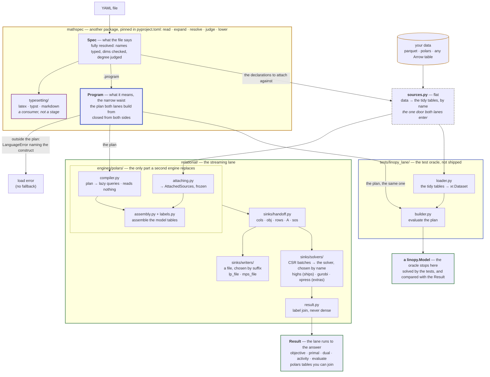
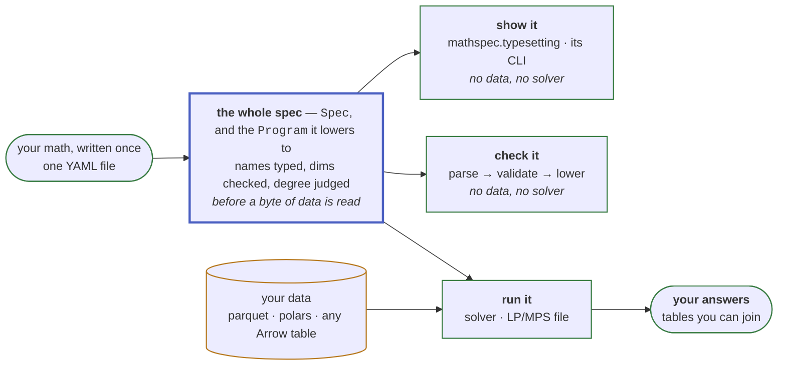

# Architecture

This page explains how the package is put together and why. It is for anyone who
changes its structure, adds a lane, sink or operator, or decides what may enter
the language.

A PR that changes the structure described here updates this file. The language
is
[the language reference](https://mathspec.readthedocs.io/en/latest/reference/language/).
What may enter it is
[the limits of the language](https://mathspec.readthedocs.io/en/latest/about/limits/). Plans
and refusals are [the roadmap](roadmap.md). Measured results are
[the benchmarks](benchmarks.md), produced by the harness in
[bench/](https://github.com/fluxopt/specsolve/blob/main/bench/README.md), which is
also how a claim on this page gets falsified.

`python examples/walkthrough.py` runs the pipeline below stage by stage,
through the same public calls `sps.solve` makes. Its output is committed as
[examples/walkthrough.out](https://github.com/fluxopt/specsolve/blob/main/examples/walkthrough.out)
and asserted line for line by `tests/test_walkthrough.py`.

[The glossary](../reference/glossary.md) defines the nouns this page uses. The
package builds a program along one *lane*, the relational lane (`relational/`),
which streams a plan to a sink. The test suite builds the same program a second
way, as a `linopy.Model` (`tests/linopy_lane/`), and compares the two: that is
the oracle.

## Thesis

A YAML math spec is a **closed AST known before any data is touched**. So the
whole spec can be compiled two ways: to eager xarray/linopy calls in the test
oracle, or to a logical plan streamed to a sink. Both paths provably mean the
same thing. A
*declared* memory ceiling is not something the package has; see [the memory
axis](roadmap.md#where-it-is-going).

**The producer of the AST is a different package.** `mathspec` parses, expands,
resolves and judges a file, and this repository consumes what comes out. The
widest fence in the drawing is `pyproject.toml`, the amber box labelled
mathspec. Everything in it, the typesetter included, is that one package, and
it cannot import anything here. **Its passes are named in the box and not
drawn**; they are mathspec's architecture, documented and tested there. The
rest is the package's lane and, beside it in the test suite, the oracle.

**Data enters below the seam through one door, and both lanes enter by it.** The
dashed box, `sources.py`, is outside every fence. It reads the schema, which the
engine never does ([hard rule 2](#hard-rules)). `sources.tidy_sources` reads
every shape [the data contract](../reference/data.md) accepts into tidy polars
tables. The relational engine executes its plan against those tables directly.
The oracle's `tests/linopy_lane/loader.py` converts them to pandas and xarray at
its own boundary. So polars is the one representation, and pandas is not a
dependency. One reader for both lanes
costs the oracle a copy of what a pandas caller passed (#1076).

What a spec assumes of its data sits below the seam because it needs values
rather than a schema. It lives in `assumptions.py`, which the door calls, so
neither lane can enter without it. Data goes no further **up** than here, so
nothing above the seam has ever seen a value.

The diagram shows the whole pipeline: mathspec reads a file into a `Spec` and
lowers it to the `Program`, `sources.py` turns your data into tidy tables, and
each lane takes both.

**The lanes are peers in what they take, not in what they hand back.** Both
accept the same file, attach the same tables and refuse the same constructs.
`relational/` drains the model through a sink and reads back a `Result`. The
oracle stops at the `linopy.Model`, which the tests solve and read back with
linopy.

**Ten modules sit outside a fence, and each is legitimately both halves**:
`sources.py`, `assumptions.py`, `api.py`, `strategy.py`, `lanes.py`,
`frames.py`, `layout.py`, `archive.py`, `expressions.py` and `errors.py`. Size
does not buy a place among them. A module only one lane reaches is that lane's, down to a
24-line contextmanager (`tests/linopy_lane/_notes.py`). See [What counts as
language](#what-counts-as-language).

**Eligibility is decided by attempting the lowering.** `lanes.lowered` returns
a `Program` or raises `sps.LanguageError`. Both lanes call it, so "neither lane
accepts a file the other refuses" is mechanical rather than maintained.
The oracle asks only for the verdict and discards the plan. Errors split spec
from run. Everything under `LanguageError` is decidable without data,
`DataError` is what a source failed to supply, and both are `SpecsolveError`
(`errors.py`). The third thing that can be wrong is a spec the language
accepts and specsolve cannot build. That raises `SpecsolveError` itself, naming
the rewrite ([hard rule 3](#hard-rules)). Expansion precedes validation in **both** lanes, because a
formulation emits declarations and those are language too.

## One contract, many consumers

The AST is a **narrow waist**. Everything upstream emits it, everything
downstream reads it, and nothing else has to agree on anything. So the spec
you write once is the same spec that gets checked, solved, typeset and read
back.

The diagram shows one YAML file becoming the whole spec, and three consumers
reading it: show it, check it and run it.

**Only the run arrow carries data, and it arrives after the spec is already
judged.** A `Spec` is complete before a source is attached: names typed, dims
checked, degree decided. `check` is the build's own front half, stopped before
attaching. That is why it is a CI verb, costs seconds, and needs nothing but
the file.

**Each box is a family, and [the table below](#the-python-surface) lists the
members this package answers.** Each reads the same AST the engine reads. So a
renderer is a tree walk, a check is a pass with no data attached, and a new
output format is one module in `relational/sinks/writers/`.

**The renderer is that claim cashed, and it is not here.**
`mathspec.typesetting` typesets any spec the lanes can build, in one walk of
the resolved AST. A `piecewise:` block prints as the curve it states, and its
expansion as the rows. It lives in the package that owns the language, and this package does not
depend on it. A consumer that reads the AST and nothing else needs no part of
this repository to run. The waist is **closed**, which is what [the limits of
the language](https://mathspec.readthedocs.io/en/latest/about/limits/)
protects: a new consumer is free, a new primitive is taxed.

### The Python surface

**Twenty-seven names, and the count is the feature.** The spec is the YAML file,
and Python is how you *run* it. So nothing on the surface constructs math or
reaches the plan. The names, by role:

- the five verbs `check`, `build`, `evaluate`, `solve` and `write`;
- the fold `solve_over` with its two axes;
- the two archives that carry a spec, its data and its answer, `SolveArchive`
  and `SweepArchive`, with `load_archive`, `load_result` and `load_sweep` to read
  one back whole and `scan_archive`, `scan_result` and `scan_sweep` to read it
  off the directory it lies in;
- the three types a verb hands back, `Model`, `Result` and `Sweep`;
- the error tree under `SpecsolveError`, `NoSolutionError` and `SpecsolveWarning`.

What each one takes and returns is its docstring, which
[the Python API](../reference/api.md) renders. The docstrings are the reference,
so there is no second hand-written copy of it to drift.
`evaluate`, which reads a spec of parameters and expressions as arithmetic,
needs no solver installed.

**Loading a file and rendering one are not on this list.** `to_spec`,
`SymbolTable`, the three `to_…` renderers and the shell front that runs them are
`mathspec.`'s, counted in its own `__all__`. One name, one home. `check` hands
back a `Program` and every verb accepts a `Spec`. Obtaining either means calling
`mathspec`, so a caller annotating one is already in the package that owns it.
**The errors are the only exception**, because a caller meets them *without
choosing to*: a `LanguageError` arrives unbidden out of `sps.solve`.

**Nothing here reads a `Spec`.** Attaching, the guards and both lanes take the
`Program`. A verb reads a `Spec` only for the `Program` it carries, through
`lanes.lowered`. The spec *as written* is `mathspec`'s side of the
line: editing it, dumping it and typesetting it.

**What a verb hands back is part of its signature.** A caller that *wraps* this
package writes the type down. A type it cannot import is a type it cannot write.
So `Model`, `Result` and `Sweep` are named here. So are `NoSolutionError`, which
every reader on a `Result` raises, and `SpecsolveWarning`, which `check` emits. A
sweep that records an infeasible scenario rather than dying on it needs both by
name. None of the five constructs math or reaches the plan.

**The namespace is flat.** `solve_over` and its axes sit at the top level
beside `solve`. The surface test exempts submodules (`not inspect.ismodule`).
So moving names under `specsolve.something` moves them out from under the list
a reviewer reads.

**A handle's methods answer "what do I do with this", never "what is this"**:
`solve`, `write`, `close` and `update` pass. What the objects carry is [the
Python API](../reference/api.md)'s to list. Anything that changed a declaration
would be a language feature wearing a method, which hard rule 5 refuses wherever
it is spelled. The handles are named for what they *are* rather than for what
built them. A second engine must not change a top-level verb's return type.

**What the data arrow carries** is [the data contract](../reference/data.md).
The one structural fact: **attaching is by name at both levels**, the mapping
keyed by declared parameter and the columns by that parameter's declared dims.
The single positional fallback (an *unnamed* pandas index) is narrow on
purpose. Renaming a named level would transpose the data silently whenever two
dims share a label space.

`tests/test_architecture.py` pins all of it: `__all__` must match its own
list by role, **and** no public non-module attribute may exist outside it. The first
direction catches a name documented and never exported, the second a helper
that leaked into the namespace from the top of `__init__.py`.

## Hard rules

*Enforced, not aspirational: `tests/test_architecture.py` encodes these as
static checks, and CI's bare-install job proves the dependency claims.*

**These rules constrain the language**: what a construct may say, which layer
may know what, and what a file means on its own. How much a build *costs* is a
property of the engine, measured in [the benchmarks](benchmarks.md), and not a
rule. A cost phrased as a rule makes one implementation's choice load-bearing in
the language's rulebook.

0. **The layers are ordered, and imports prove it.** Every module imports only
   downward, at module level, with **no exception at all**.
   `DELIBERATE_LAZY_IMPORTS` in `tests/test_architecture.py` is empty, and an
   undeclared in-function import fails the build. A lazy import here is a cycle
   to remove, not to defer.
1. **Core AST is the whole language, and the language is upstream.** Both lanes
   consume only core AST. Macros are substituted away by the language before
   dispatch, and so is a named expression unless it states `cases:`; a
   `piecewise:` block is written out by the caller (`Spec.expand`) before the
   door, the language refusing one left as written. That one
   arrives as a node of its own, because a substitution cannot carry a mask in a
   value position. The plan, the query and the xarray are private to their lane.
   The AST crossing that seam is **fully resolved**, with names typed
   `Variable`/`Parameter`/`Dimension`. So a lane cannot hold its own opinion
   about what a name refers to. What a spec *means* cannot depend on what is
   done with it, because the package that decides the meaning cannot import this
   one ([above](#thesis)). **Our half of it is checked**: every `mathspec`
   import under `src/specsolve` names the package and never a module inside it
   (`test_the_language_is_imported_as_one_package`). So what this repository
   depends on is the one `__all__` mathspec pins, never a private name a
   submodule path could carry.
2. **The engine knows nothing about linopy, xarray or YAML.** `relational/` goes
   plan → engine → a solver sink → solver. It matches linopy's semantics as a
   spec rather than sharing its code. It never sees the schema, the AST, or the
   oracle's builder. **The engine is a directory, not a convention.**
   `engines/polars/` is one implementation. Everything above it is what any
   implementation answers to: `sinks/`, `status.py`, and the plan vocabulary,
   which is `mathspec.program`'s. An engine package is named for its engine;
   nothing *inside* one is. The engine imports nothing from the package bar one
   declared leaf (`errors.py`, in `ENGINE_MAY_IMPORT`), which keeps the
   subpackage extractable. **`errors.py` is a leaf by name and not by cost**: it
   re-exports the language's half of the hierarchy, so importing it loads the
   language. What the engine raises through it is `DataError`, a verdict about
   the *data*, and `SpecsolveError`, a verdict about the engine's reach.
3. **One language, two builds, and linopy is only the oracle.** The package and
   the test oracle both pass the one `lanes.lowered` gate ([above](#thesis)). No
   operator registry exists that could create a divergence. A construct outside
   the language is a load error naming the construct and its rewrite. What that
   equality buys is [the oracle](linopy.md#2-it-is-the-oracle). linopy is a test
   dependency, and nothing under `src/` imports it.

   **Accepting is not building, and one construct now separates them.**
   `linopy.Model.add_constraints` refuses a `QuadraticExpression`, so the
   oracle cannot build a quadratic *constraint*. The oracle declares that in the
   sinks' vocabulary (`tests/linopy_lane/builder.py`) and refuses it before
   linopy is asked. **What it costs is the oracle.** A construct only the package
   builds is checked by the package alone. The oracle is two
   independent encodings reaching one optimum, plus a residual at the returned
   primal.
4. **Backend-visible YAML files are self-contained.** No Python-side state
   (registries, session objects) may change what a file means.
5. **The public interface is a declared spec, not a Python API.** YAML is what
   we ship and document. A `.yaml` file is the thing you review, diff and cite.
   There is no API for *constructing* a spec, no way to hand in a plan, and no
   registry to populate. The contract underneath is the language's two states, a
   `Spec` and the `Program` it lowers to. Whether that seam is ever blessed is
   open ([#381](https://github.com/fluxopt/specsolve/issues/381)). The Python
   surface is the runner (`api.py`) and the driver over it (`strategy.py`); the
   plan is internal. The whole of it is [twenty-seven
   names](#the-python-surface), pinned by a test.

## The plan, node for node

**The plan is the vocabulary both lanes speak.** Each node has one meaning per
lane. This table is what the file writes and what the relational lane's query
does with it. The oracle's linopy call for each row is [what a construct
becomes in the oracle](linopy.md#what-a-construct-becomes-in-the-oracle). `tests/test_docs_site.py` holds it
to `mathspec.program.Expression`'s own subclasses, so no node lacks a row.

**The plan decides what is sayable; the engine only builds.** Every refusal
about the shape of a file is the language's. It is made upstream when the spec
is validated, and never re-decided on this side of the pin. That covers a
reduction over a dimension its operand does not span, a mask wider than what it
masks, a bound reaching past its variable, and a degree no position takes. The
engine asserts those; reaching one is a program that was never a valid spec. The
two verdicts it still *raises* are its own: `DataError` about the data, and a
`SpecsolveError` for the one construct the language accepts and this lane
cannot build (#1137).

**Fan-in** is the column the lanes *act* on. It says how an output row's slots
relate to the input's. `fragments.fan_in` answers it for every node, and the
relational lane's compiler asks it. Anything but one-to-one mixes several input slots into one output row. So
absence has to be pushed into the operand before the rewrite consumes it
([#1142](https://github.com/fluxopt/specsolve/issues/1142)).

| plan node | the file writes | fan-in | the relational query |
| --- | --- | --- | --- |
| `Constant` | a number | one-to-one | a one-row const fragment |
| `Parameter` | a declared name | one-to-one | its table as `(dims…, cval)` |
| `Variable` | a declared name | one-to-one | `(dims…, var_label, coeff=1)`, plus where it exists; at a read, its primal as a const fragment with the same presence, a zero at every absent slot under `absence: zero` |
| `Dual` | `dual(c)` | one-to-one | at a read only: the constraint's rows beside its share of the dual vector, a const fragment present exactly where a row stands |
| `Negate` | `-x` | one-to-one | the value column negated |
| `Add` | `x + y`, `x - y` | one-to-one | the two fragment lists concatenated |
| `Multiply` | `x * y` | one-to-one | a join on the shared dims; two variable factors pair into a quadratic fragment |
| `Divide` | `x / p` | one-to-one | a **left** join, so a divisor with no value leaves a null to report |
| `Power` | `p ** q` | one-to-one | an inner join and `pow` |
| `Sum` | `sum(x)`, `sum(x, over=d)` | many-to-one | the summed dims projected away — no aggregate |
| `GroupSum` | `sum(x, by=r, over=c, into=d)` | many-to-one | one inner join with the relation's table on the columns the direction consumes and joins on, the consumed dims traded for the produced ones; a bare relation fans a member out to every target |
| `Pullback` | `at(x, by=r, over=d, into=c)` | one-to-one | the same table joined the other way, fanning out |
| `Translate` | `shift(x, along=d, offset=n)` | one-to-one | a remap through the dimension's `ord`, modulo its size under `wrap` |
| `WindowSum` | `sum_back(x, along=d, window=w)` | one-to-many | a row lands at every position whose window reaches it — no aggregate |
| `Cases` | a named expression's `cases:` block | one-to-one | each region's value cut to its own mask and the fragment lists concatenated |
| `Named` | the name of an `expressions:` entry | one-to-one | its body, compiled where the name stands |

A `Cases` is the one node carrying a **mask in a value position**. It is also
the one whose several values are alternatives rather than slots summed together.
The language proves the regions disjoint and total before any data attaches. So
an output row reads exactly one of them, and neither lane ranks them. A region
empty at a coordinate it does not claim must leave the row that the other
regions cover.

**A read is the one walk where every leaf is a number.** A named expression is
evaluated after the solve, never built. The relational lane compiles a variable
to its primal and `dual(c)` to the constraint's row duals, as const fragments.
The oracle reads `.solution` and `.dual` and does xarray arithmetic. So the
language holds an entry the math never reads to no degree. A product of two
variables, a variable under a power and a division by one are arithmetic over
values. `Dual` is the one node a build refuses on sight. A solve that left no
duals refuses the read with the sentence `result.dual` gives, and every other
entry still reads.

**Neither reduction aggregates.** A `Sum` drops columns, a `GroupSum` swaps
them and a `WindowSum` replicates rows. Every duplicate collapses once, in the
terminal `SUM(coeff) GROUP BY row, col` at assembly. The polars column
conventions are in `compiler.py` and `fragments.py`.

## The relational lane

**The spine is one module per box above**: `attaching.py`, `compiler.py`,
`assembly.py`, `sinks/`, and `engine.py`, which runs that lifecycle and holds
the solver between solves. `labels.py`, `readback.py` and `result.py` sit beside
the engine, because each answers a question the engine only *uses*.
`scope.py` sits under all of them: the program, its attached data and the
variable frames built so far, which is what every helper takes and the
compiler holds beside the walk it adds. `fragments.py`, `predicates.py`,
`reindex.py`, `coverage.py` and `status.py` are off the spine and undrawn. `frames.py`, the other boundary, is top level because
all three consumers read it. The [module map](#module-map) says what each does.

That split makes the ceiling's admissibility test something you can *perform*:
build a `PolarsCompiler` over a `Scope`, hand it a node, read `.explain()`.
`tests/test_compiler.py` does that over empty tables, since a schema is all it
takes to compile a query.

**What attaching produces is a value.** `AttachedSources` is frozen: parameters,
dimensions, their cardinalities, and which parameters are boolean. The variable
tables are passed *beside* it and stay mutable. A variable table appears as its
declaration is built, and a constraint compiled afterwards has to see it. That
is the one live registry in the lane, and it is visible in a signature.

**What a build produces is a value too.** `BuiltModel` is frozen: the sink's
`Handoff`, held as one field rather than restated, and the label table each
declaration owns. What fills during assembly lives on `Assembly`, discarded
once it has frozen, the compiler with it. So the engine holds one field rather
than seven, `close()` is one assignment, and a build that raises leaves no
model rather than half of one. What survives that release is `Measured`, the
counts `diagnostics()` reports.

**Tables are tidy.** Parameters are `(dims…, value)`. A variable table is
`(dims…, var_label)`, one row per *existing* variable. A linear expression is
`(dims…, var_label, coeff)` plus a constant part. Constraint rows are `(row,
sense, rhs)`. The coefficient matrix is COO `(row, col, coeff)` while
declarations build, and lands as CSR at assembly. CSR is `(col, coeff)` in
row-major order plus a `row_starts` offset array: the same three arrays a solver
takes, at 12 bytes per entry. Masks are **row absence**: no NaN sentinels, no
`-1` labels. Broadcasting is a join. `sum` drops coordinate columns, and
`sum(by=)` joins a declared relation's table and projects the columns the walk
produces in place of the ones it consumes ([above](#the-plan-node-for-node)).
A relation's table is attached as declared, one column per column under its
own name, so a walk reads any shape the language admits: a key of several
columns, several value columns, a bare relation, two columns over one
dimension, or a self-map.

**The label contract is the one place order is load-bearing.** Everything else
in the lane is order-free, which is what lets the query planner rearrange it.

- **Labels are dense `0..n-1` by construction**, so `var_label` **is** the
  solver column index and `row` the solver row index, with no remapping. That is
  what `update` spends. New bounds, costs and right-hand sides go onto a loaded
  solver by position. Appending rows moves no column and renumbers no existing
  row. Structural editing stays out of scope; an update that *does* move a label
  is a rebuild, and the answer is the same either way.
- **Labels are row-major over the masked coordinate product**, sorted on the
  dimensions' declared ordinals. That is what makes a build reproducible run to
  run.
- **Variables and constraint rows are the same operation over different
  tables**, written once (`labels.frame`): number the surviving coordinates by
  their row-major position in the declared product. A mask that cannot see the
  leading dims leaves the survivors a *rectangle*, so only the masked suffix is
  materialised. That guarded shortcut must reach the integers the general path
  would have. Nothing else about a build can move an index.
- **The same order comes back.** `primal` / `dual` / `save` read the label
  table, which was numbered in that order, and the LP sink writes it.

**The plan is affine-by-design.** No node introduces variables or constraints as
a side effect of an expression; formulations are spec *transformations*.
Variable *types* are not formulations. Binary and integer are a `vtype` column,
LP `binary`/`general` sections and HiGHS integrality, which keeps basic MILP
inside the relational lane. **`sos:` is the same shape.** It is a
`SosDeclaration` naming columns the variable already made, one more stream out
of the engine and no expression node. So a set can be carried whole to a sink
that has the concept. Reimplementing a reformulation pass inside the plan is
rejected: the language writes a formulation out itself (`Spec.expand`), and a
sink with no SOS concept is handed the model so written rather than a rewrite
of the built tables. The same rule decides the door: a `piecewise:` block
states rows nothing lowers, and specsolve refuses a spec still carrying one
rather than expanding it unasked, so a spec arrives with its curves expanded, and the sets expanded or not
as the caller's sinks demand.

**A frame is the boundary in both directions.** `frames.py` recognises a
caller's table through the Arrow PyCapsule protocol without importing any
dataframe library. `Result.primal` hands back a `polars.DataFrame`, which
exports the same protocol. That symmetry keeps pandas and pyarrow off the
dependency list: they are bridges *out* (`to_pandas`, `to_dataarray`), and
the caller installs them. The bare-install CI job runs the suite with neither
present.

**Sinks are capped, explicitly.** Four streams and no more: `cols` (bounds,
objective coefficients, integrality), `rows`, `A` in CSR, and `sos`, the
special-ordered sets as `(set, type, col, weight)`. The upgrade path
from here is `genconstr`, plus a semi-continuous threshold on `cols`.

**The fourth stream is the one that lands unevenly**, because its destination
differs per sink (see [what each tool decides for
itself](https://mathspec.readthedocs.io/en/latest/about/what-counts-as-language/#what-each-tool-decides-for-itself)).
So a solver **declares** whether it takes one, and the *family* acts on the
answer (`sinks.refusal`): a sink with no SOS concept refuses the model, and the
refusal names `Spec.expand()`, which writes each set out as binaries and
linking rows the language states rather than this package. Nothing is appended
past the model at the hand-off, so what a solve reads back is what was built.

**A sink is one of two things, and the directory says which.** A **solver** runs
the tables and returns an answer, chosen by **name** at the call
(`solver_name='gurobi'`). A **writer** renders them to a file, chosen by the
output's **suffix**. Both sets are closed dict literals (`SOLVERS`, `WRITERS`):
no YAML key names a solver, and nothing installed may change what either
resolves to. The split is a directory for the reason `engines/` is. **How many
solvers there are will change; what a solver has to answer will not.** A new
solver is a module named for it and a line in `SOLVERS`, and nothing above it
changes. Members share the projection of `cols` and `obj` onto the solver's
column index, which lives on `Handoff`. So two solvers cannot drift into loading
different models. They never share hand-off code, for two reasons. The
currencies differ: HiGHS and Xpress take the three CSR arrays, gurobipy a matrix
object. And an optional package must stay off the import path of a caller who
does not use it.

### Quadratic objectives at the sink

Neither direct API has a per-coefficient counterpart to `changeCoeff`:
`passHessian` and `setMObjective` take the quadratic part whole. Under the
aligned-only scope (`variable × variable` at the same coordinates) `Q` is
**diagonal**, so it costs 16 bytes per quadratic column. That is 0.16 GB at 10⁷
columns and 1.60 GB at 10⁸, against a direct-sink peak already dominated by the
solver's own model. HiGHS accepts `dim_ < num_col` (verified), so ordering the
quadratic variables first bounds the Hessian to that block.

**The diagonal argument dies as soon as the product is not aligned**, and the
language does not restrict it to aligned. `x[i] * y[i, j]` broadcasts, and
`x[i] * y[j] * a[i, j]` joins through a table. The replacement bound is one
entry per pair the expression states, the `nnz` of whatever couples the
factors, still a declared-shape quantity. What is not is the cross join of two
reductions, the shape the language refuses (`mathspec.degree`).

**Whole is not the same as reloading.** A second `passHessian` lands on the
model already loaded, replacing `Q` and leaving the LP standing. So a moved
quadratic *coefficient* is pushed like a cost, and only the sparsity *pattern*
is structure.

## Module map

| Module | Role |
|---|---|
| `mathspec` (a dependency) | the whole language, read, expanded, resolved, judged and lowered there; what crosses is a `Spec` and the `Program` it lowers to — [its own reference](https://mathspec.readthedocs.io/en/latest/reference/language/) |
| `api.py` | the runner: `check` / `build` / `solve` / `write`, and `load_result` / `scan_result` for an answer read back off disk; linopy-free |
| `layout.py` | below every verb that solves: what an archive holds — `spec.yaml`, `sources/`, `answer/`, `axis.json` — written as one zip or as a directory, because a solve is the one moment all three exist together |
| `archive.py` | above the runner and the fold: `load_archive` / `scan_archive` and the two values they give back, `SolveArchive` and `SweepArchive`. It reads; it never writes |
| `lanes.py` | above both lanes: `Buildable` and `Source`, what every verb takes; `Label`, a dimension's labels and a sweep's keys; `lowered`, the one door every verb lowers a spec through |
| `relational/collect.py` | which polars engine materialises a frame: the streaming one where this polars has it, asked once; a build without it, the browser's, gets the in-memory one |
| `sources.py` | the one door: caller data (parquet paths, in-memory tables, plain-Python shapes) read into tidy tables and checked against the declarations |
| `assumptions.py` | the one guard that needs numbers: every `assumptions:` entry the file wrote, and each condition a `piecewise:` method puts on its breakpoints, evaluated as the masks the language states them as |
| `frames.py` | the boundary: caller tables in, via the Arrow PyCapsule protocol; read by the front door, the driver and the oracle |
| `errors.py` | the run half, and the whole re-exported: what a caller catches off `sps.`; a wording lives here only where two modules raise it |
| `strategy.py` | the driver above the runner: one plan per slice, folded — scenarios, rolling horizon, myopic pathways |
| `projection.py` | the other driver: the feasible region on two named quantities, traced by re-solving one built model along directions until no edge has anything beyond it |
| `relational/engines/polars/scope.py` | the scope a query is compiled in: the program, its attached data and the variable frames built so far; the product of its dimensions and the one row-major rule every index reads — what every helper takes, and the compiler holds |
| `relational/engines/polars/compiler.py` | plan → lazy queries; pure, reads nothing |
| `relational/engines/polars/relations.py` | a relation's table as a walk reads it, the one place a role becomes a column: the join a group or a pullback trades its dimensions through, and the grouping a partition ranks inside, the whole dimension being one group |
| `relational/engines/polars/reindex.py` | `shift` and `sum_back`: a fragment's rows moved along one dimension's own order, and the edge |
| `relational/engines/polars/predicates.py` | a `where:` mask as a boolean query over the coordinate product; the plan's predicate nodes and nothing else |
| `relational/engines/polars/fragments.py` | what an expression compiles *to*: the additive pieces and the arithmetic over them; no state, no data |
| `relational/status.py` | solve outcome on two axes; linopy's vocabulary, copied not imported |
| `relational/engines/polars/labels.py` | which coordinate gets which solver index; one rule, one guarded shortcut that must agree with it |
| `relational/engines/polars/attaching.py` | the door's tables → `AttachedSources`, the frozen, `Enum`-encoded tables every query is written against |
| `relational/engines/polars/assembly.py` | one build: every declaration into rows of the model tables, quadratic constraints last |
| `relational/engines/polars/coverage.py` | is the data there where a declaration reads it: a divisor, and a constant piece, each refused at the last moment the gap is still visible |
| `relational/engines/polars/readback.py` | a built row, a solve's tables and a named expression, spelled back out in the model's own labels |
| `relational/engines/polars/engine.py` | the lifecycle: build, hand to a sink, read back; the counters and clocks `diagnostics()` reports; and the one read with no build, a spec of parameters and expressions valued as arithmetic |
| `relational/result.py` | what a solve returned: status, objective, the label joins that read values back, and the deferred expression readers |
| `expressions.py` | expressions spliced into the spec as written and lowered with it — what a reader values when the file never named the quantity |
| `relational/parquet.py` | answers on disk: the `<kind>/<name>` layout a result and a sweep both write, and the writer that lands a file whole |
| `relational/sinks/handoff.py` | what every sink reads and no more: the five tables, the batching scalars, and their projection onto the solver's column index |
| `relational/sinks/capabilities.py` | what a sink can ingest — hard rule 3's *accepts ≠ builds* axis; `lanes.py` declares each **lane** in the same vocabulary |
| `relational/sinks/` | how a built model leaves, in two families: `solvers/` (one module per solver, chosen by name) and `writers/` (one per format, chosen by suffix) — [README](https://github.com/fluxopt/specsolve/blob/main/src/specsolve/relational/sinks/README.md) |

**One subpackage, and the directory *is* the rule.** Everything
under `relational/` is the relational lane, and it imports nothing else from
the package. Inside it, `engines/` holds implementations and the rest is what
they implement. No module of the package imports linopy, and none imports
xarray at module level. `tests/test_architecture.py` holds both rules.

**A fence whose allowlist is empty is a package waiting to happen.** What
remains points one way. `relational/`'s fence is at one declared leaf,
`errors.py` (hard rule 2). The language's fence is nowhere, because the language
is not here.

### What counts as language

The rule is
[its own page](https://mathspec.readthedocs.io/en/latest/about/what-counts-as-language/),
because it decides what may live here rather than how this package is
arranged:

> **A rule is language iff two consumers answering it separately would be a
> bug.**

Every "one implementation each" rule in this file is that test applied, and the
implementations are upstream. Names resolve once (`mathspec.resolution`). The
operator set is closed (`mathspec.operators`). Lowering turns it into the
closed plan-node set both lanes dispatch on, so neither lane keeps a table of
operator names. An operator's dim rule, its dim *set* and its verdict on an
operand that lacks the dim being reduced along live only in
`mathspec.dimensions`. Lowering **asks** for the verdict rather than deciding
again. Degree lives only in `mathspec.degree`. `mathspec.piecewise` is
upstream by the same test: a formulation emits declarations, and declarations
are language.

The test also says what cannot follow. `assumptions.py` answers a question two
consumers answering separately *would* be a bug, so by the rule it is language.
It is here because the answer needs numbers, and the language has never seen
one. The half that does not need them is upstream: a spec's `assumptions` name
each condition, `assumption_message` words the refusal, and the caller holding
the values does the checking. A rule is only ours when data is what decides it,
which is what the top level is *for* ([the ten above](#thesis)). A flat module
should be arguable.

### Naming across the layers

The same construct passes through three of mathspec's layers, and each names
it in full with the layer as the suffix: `VariableBlock`, `VariableNode`,
`Variable`. The table and the two rules a new construct keeps are
[mathspec's](https://mathspec.readthedocs.io/en/latest/contributing/#naming-across-the-layers).
A rename upstream that collides here is a thing to notice. The one place
abbreviation survives on this side is column names inside the engine, which
are not Python identifiers.

### Names shared with linopy

Anything this package shares with linopy (solve statuses, result shapes, solver
metrics, duals) takes linopy's spelling, field names and decomposition. Copy
them rather than import them (rule 2). The rule and its reason are [relationship
to linopy](linopy.md#2-it-is-the-oracle); `tests/test_solve_status.py` holds the
copy to the original. Where the design differs it stays ours: there is no
`Solution` of dense arrays, because values are read back by joining labels to
coordinates.

## Extension checklists

**Add a macro or named expression:** edit YAML. Nothing else.

**Add a sink:** a module in `relational/sinks/solvers/` named for the solver, or
one in `writers/` keyed by suffix in `WRITERS`. A solver module defines
`solve_<name>` and `build_<name>` and takes one line in `SOLVERS`. It keeps its
dependency behind an extra, imported inside the function. Either way the module
declares what it can ingest, as a `Capabilities` descriptor beside the code that
knows. A sink declaring nothing reads as taking nothing. Nothing above it
changes: no method on the engine, no branch in `api.py`, no name on the Python
surface. The
[README](https://github.com/fluxopt/specsolve/blob/main/src/specsolve/relational/sinks/README.md)
is the full list, and `tests/test_architecture.py` checks the shape off the
path.

**Add a consumer of the AST** (a renderer, a checker, a report): a package of
its own, depending on `mathspec` and not on this one. It reads
`mathspec.to_spec` and stops there. If it needs the plan it is a lane, not a
consumer, and the ceiling doc is the conversation to have first.

**Add an operator:** two repositories, in this order. First
[in mathspec](https://mathspec.readthedocs.io/en/latest/contributing/#adding-an-operator),
landed and tagged. Then **here**, against that tag: the oracle's linopy implementation →
compiler case → engine → differential test through a solver *and* the LP
writer, and this file if structural. Nothing here can lower an operator the
pinned language does not parse.
[The nightly canary](https://github.com/fluxopt/specsolve/blob/main/.github/workflows/canary.yml)
says the two halves have not drifted since.

The dim rule, the degree verdict and the dense-label assignment
(`relational/engines/polars/labels.py`, shared by variables and constraint
rows) are not per-operator work: each has
[one implementation](#what-counts-as-language). What a consumer still owns is
what is about *building*: the fragment rewrite the relational compiler
performs, and the linopy call the oracle makes.
